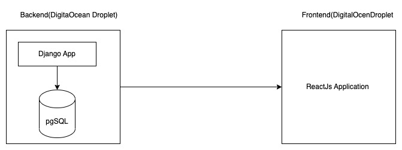
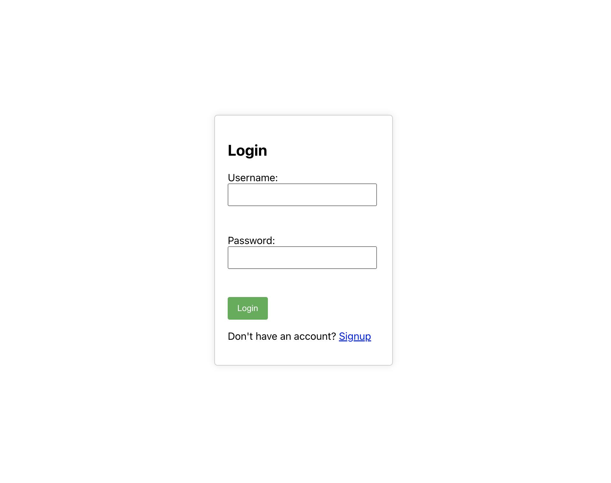
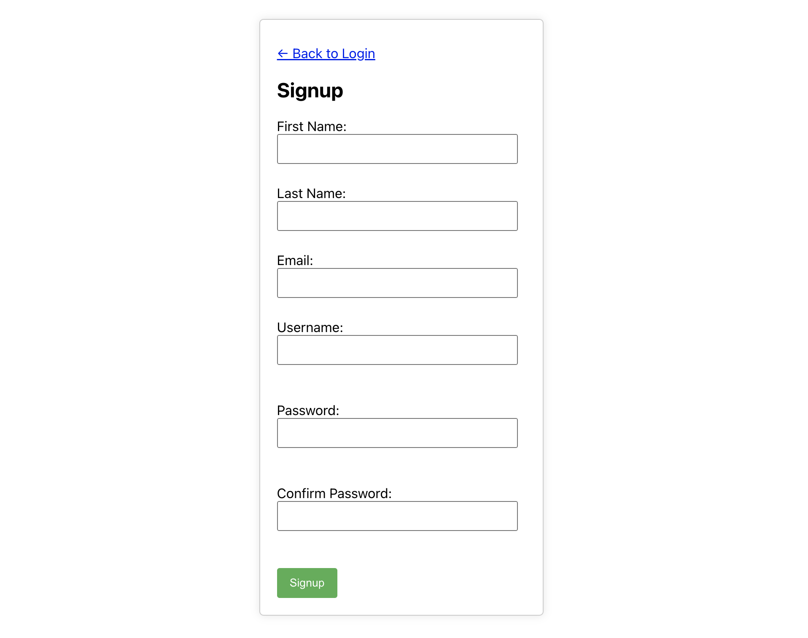
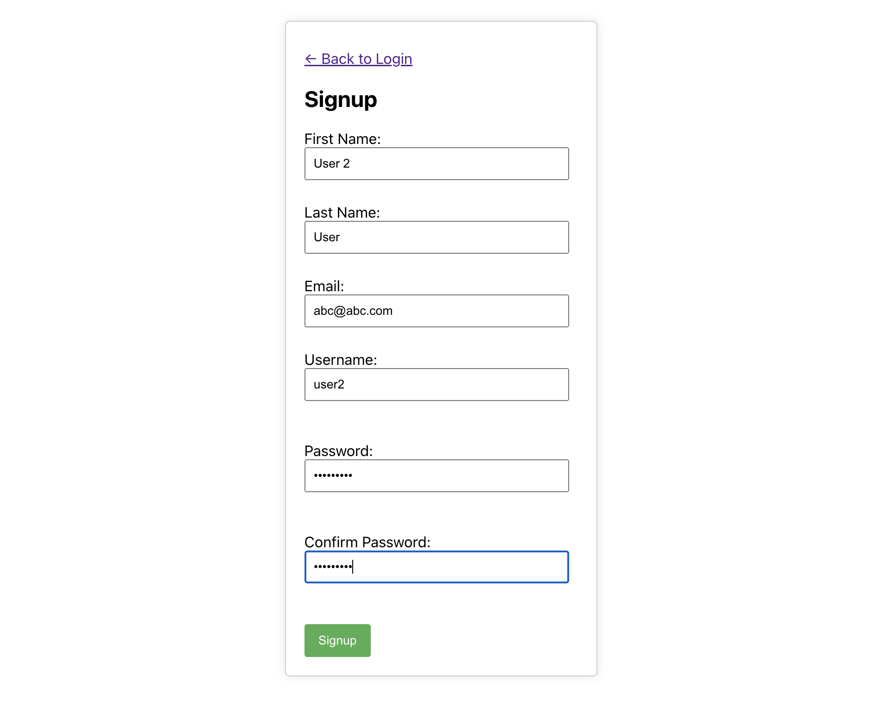
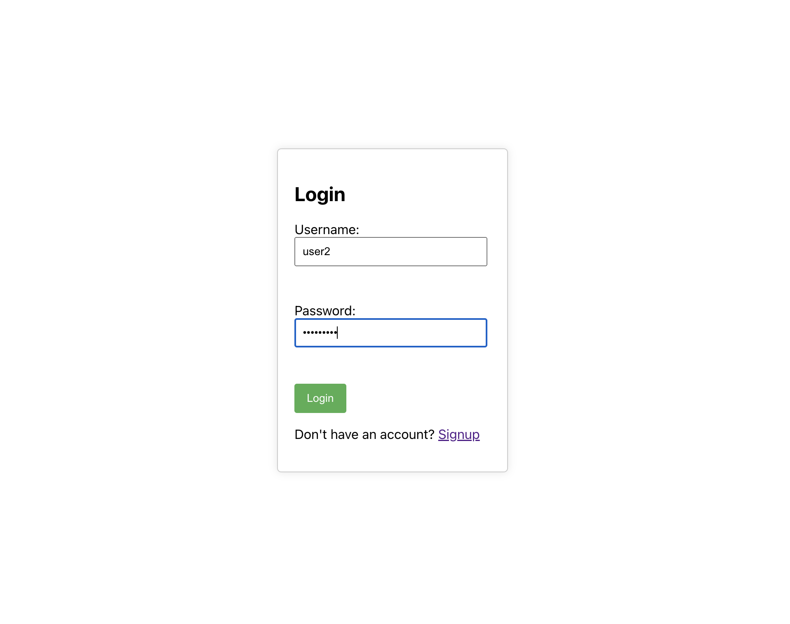
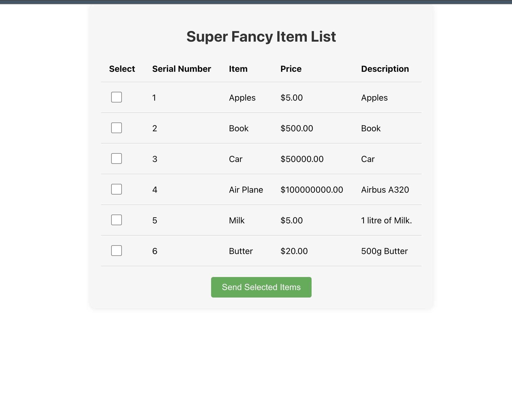
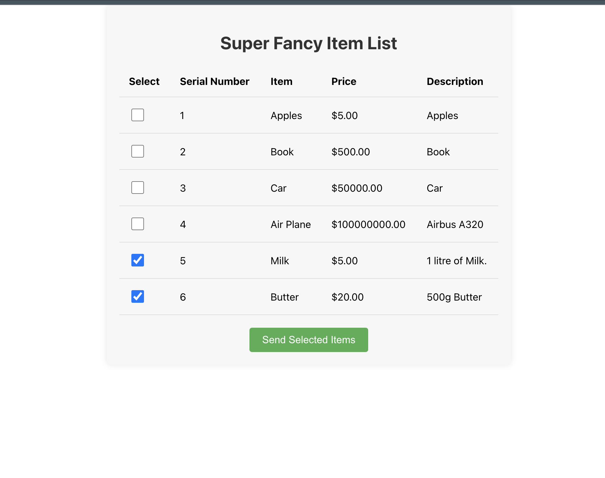
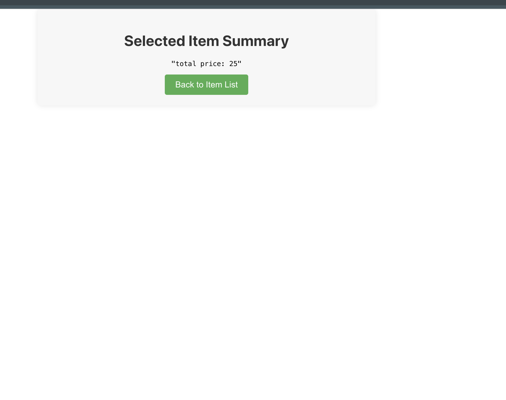

# Demo Application

## Requirements:
Create a system which includes a Database, backend and frontend. Chose Python for backend and
your choice of framework and language for frontend and database. Deploy it at your preferred
hosting solution ideally using free tier, for example, AWS, Azure, Heroku etc.

 
All calculations should happen in backend and not in the frontend. All data from the forms should be
saved in the database and not cached in the frontend.

If something is ambiguous, please use your best judgement. Use 1-3 hour for this delivery, it is fine
to take shortcuts to deliver it, please note them down.

 

You can use any authentication system, integrated with 3rd party or build your own. There is no need
to setup CI/CD but a git repo or any other source code management system is important.
Below you can see the wireframes of the system and the basic requirements.

## Implementation Details

### Backend
[Repo](https://github.com/anandsomu/ecart)
#### Dependencies:
* Python 3.9
* Django 3.2
* Django Rest Framework 3.12.4
* Postgresql 13

#### Database
The Postgres database is a managed service provided by: https://www.elephantsql.com/

#### APIs:
* User Signup/Login
* Get Items
* Get Total Price of the selected Items

OpenAPI specs are present at: `./openapi/ecart-openapi-spec.yaml` 

Api documentation is present with OpenAPI specs. Serve swagger ui with OpenAPI specs in docker:-

`docker run -p 80:8080 -e SWAGGER_JSON=/schema.yml -v ${PWD}/openapi/ecart-openapi-spec.yaml:/schema.yml swaggerapi/swagger-ui
`

### Tests:
Unit test cases are present in `./apps/item/tests.py`

### Frontend
The Frontend is a ReactJs Application.

For frontend code visit: [ekart-ui](https://github.com/anandsomu/ekart-ui)

## Steps to set up on local without docker:
1. Set up postgres database.
   

   
You could use some help...

   <pre>
   sudo -u postgres psql
   create database <em>database_name</em>;
   create user <em>username</em> with encrypted password '<em>password</em>';
   grant all privileges on database <em>database_name</em> to <em>username</em>;
   </pre>
   

2. Copy the file `sample.env` with new file name `.env` and update the variable accordingly.
3. Run `make start` to start the server.

To create default superuser run `make superuser`, credentials will be printed on console.

Both frontend and backend is containerised for easy deployment.

 

## Local setup with Docker:
1. Copy the file `sample.doc.env` with new file name `.doc.env` and update the variable according.
2. Run `make docker` to start server.

To create default superuser run `make docker-superuser`, credentials will be printed on console.

For running django shell plus use `make docker-shell` to start shell.

## Deployment:
Both backend and frontend is containerised for the ease of deployment. 

The application container is hosted on separate DigitalOcean Droplets and available for limited time.
Take it for a spin, visit the url: http://147.182.225.162

## ScreenShots:

 

 

 

 

 

 

